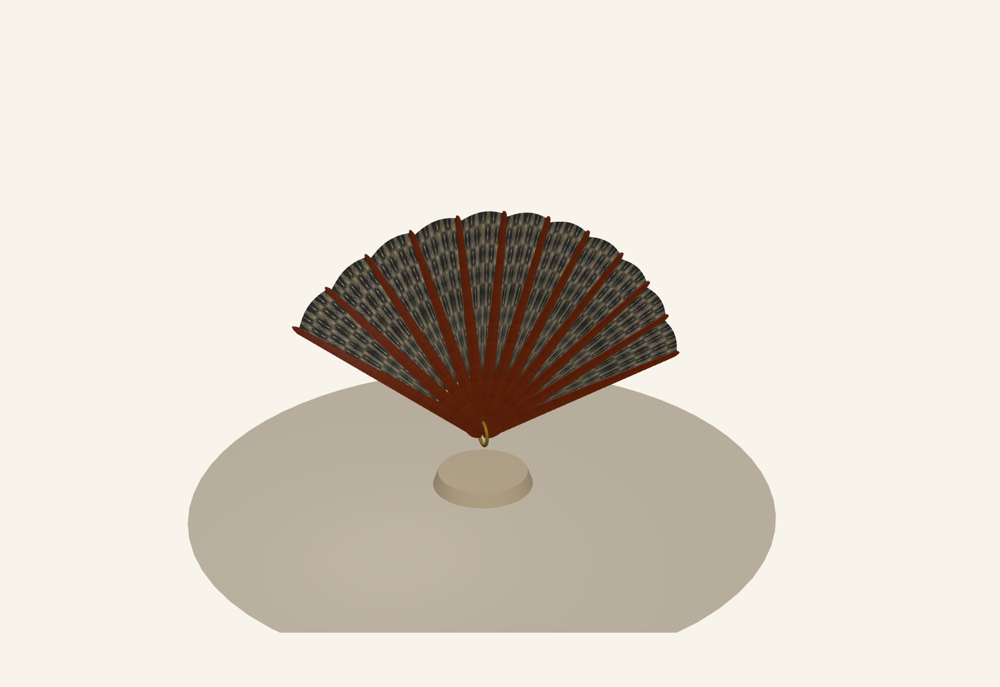
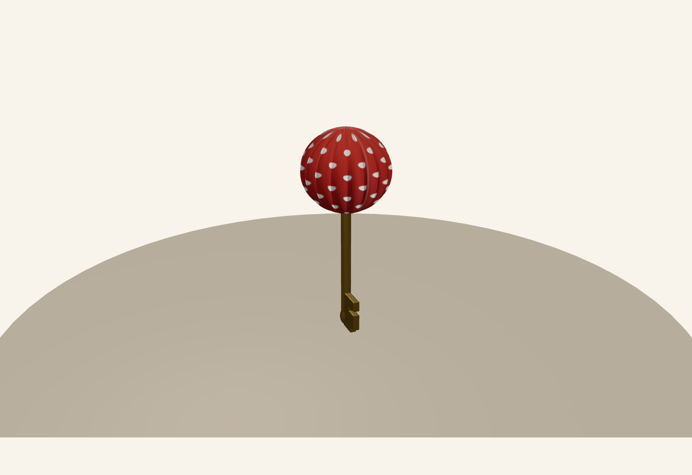
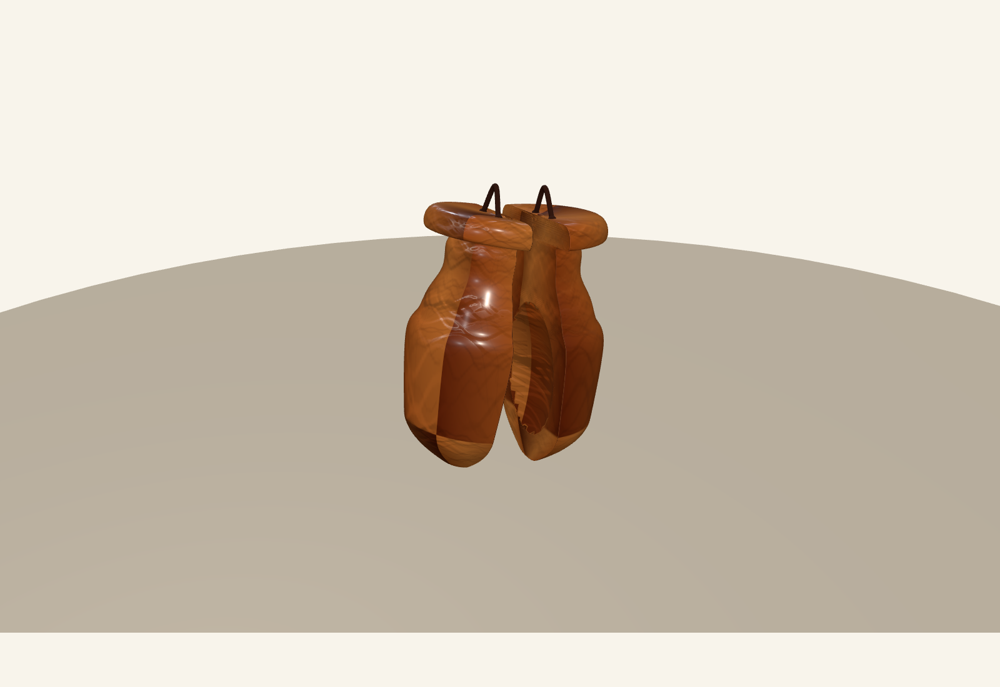
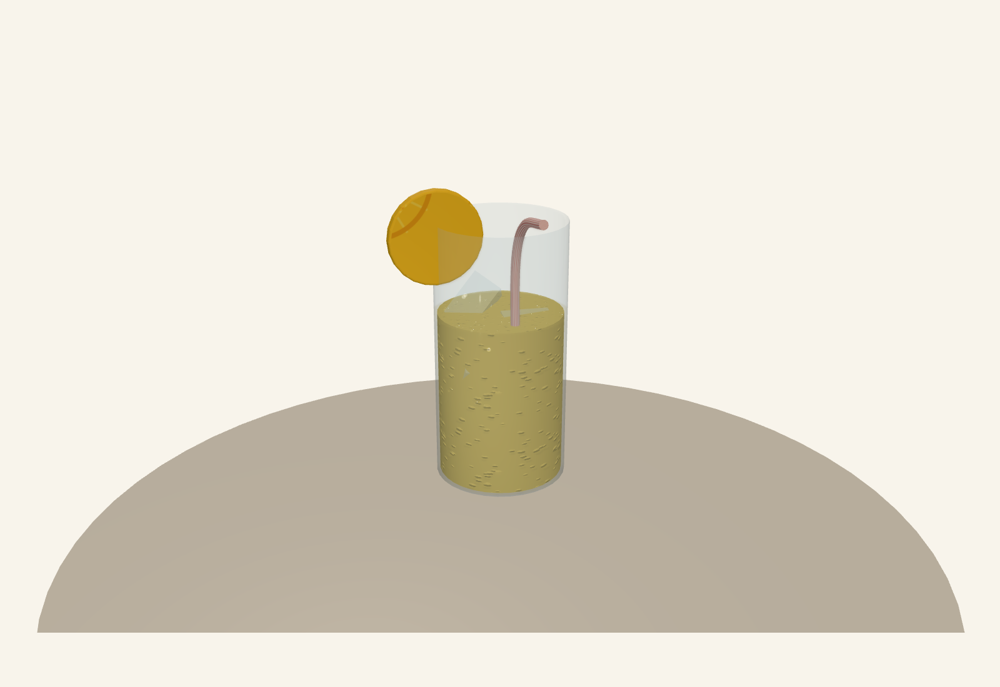

## 1. Introducción

El proyecto **Operación Tarasca: Laberinto de Volantes** es un juego 3D interactivo en primera persona desarrollado como práctica de la asignatura Sistemas Gráficos en el Grado de Ingeniería Informática. El objetivo es integrar y aplicar conceptos fundamentales de gráficos 3D en tiempo real: modelado geométrico avanzado, iluminación dinámica, sistemas de cámaras, materiales con propiedades físicas, animación interpolada y control de interacción mediante raycasting.

### Contexto y Objetivo

La temática del juego recrea una feria tradicional andaluza donde el jugador explora un laberinto en primera persona, recopila cuatro objetos (pick-ups) temáticos y finalmente accede a una puerta final mediante una llave. El desafío consiste en combinar técnicas de modelado 3D variadas (revolución, extrusión, barrido, operaciones booleanas) en un mismo proyecto, demostrando dominio de la jerarquía de transformaciones, la animación por interpolación y el control de entrada del usuario.

### Tecnologías y Herramientas

- **Three.js** (librería de gráficos WebGL)
- **TWEEN.js** (motor de animación por interpolación)
- **dat.GUI** (interfaz de depuración interactiva)
- **three-bvh-csg** (operaciones booleanas CSG)
- **PointerLockControls** (control de cámara en primera persona)
- **HTML5 Canvas** (generación de texturas procedurales)

---

## 2. Descripción General

### 2.1 Visión del Proyecto

**Operación Tarasca** es un juego exploratorio donde el jugador debe:

1. Navegar por un laberinto en primera persona.
2. Localizar y recopilar cuatro objetos dispersos: farolillo (llave), abanico, castañuelas y vaso de rebujito.
3. Acceder a una puerta final únicamente tras haber recopilado todos los pick-ups.
4. Completar el juego exitosamente.

La experiencia combina exploración, resolución de puzzles espaciales y apreciación de la dirección de arte mediante iluminación dinámica que simula la transición de día a noche conforme el jugador avanza.

### 2.2 Temática y Ambiente

El escenario recrea la atmósfera de una feria andaluza con casetas de madera, adornos coloridos y una progresión visual mediante cambios de iluminación. Los pick-ups no son objetos arbitrarios, sino elementos culturales reconocibles: farolillos de luz cálida, abanicos articulados, castañuelas de percusión y vasos de bebida regional. Esta coherencia temática refuerza la inmersión del jugador.

---

## 3. Laberinto: Construcción y Colisiones

### 3.1 Definición del Laberinto

El laberinto se especifica mediante un **archivo de texto plano** (`laberinto.txt`) donde cada línea representa una fila y cada carácter una celda de una rejilla 2D:
- `X` representa un muro sólido (volumen de colisión).
- Espacio en blanco representa una celda transitable.

Este enfoque modular permite modificar la geometría sin alterar el código 3D. La clase `Laberinto.js` parsea el archivo, construye una matriz interna y genera cubos 3D posicionados según sus coordenadas de celda.

### 3.2 Sistema de Colisiones

Se implementó un algoritmo de **validación multisample** mediante la función `puedeMoverseA(position, playerRadius)`:

1. El algoritmo comprueba **cuatro puntos** alrededor del jugador a distancia aproximada de `playerRadius`.
2. Solo autoriza el movimiento si **todos los puntos** son transitables.
3. Esto simula un volumen cilíndrico y evita que el jugador atraviese paredes incluso en movimientos diagonales.

Los pick-ups actúan como obstáculos adicionales mientras no hayan sido recogidos. Se calcula su radio de colisión a partir de la caja envolvente (`Box3`).

### 3.3 Ubicación de Objetos

Los pick-ups se posicionan mediante `posicionarPickup(obj, fila, columna)`:
1. Convierte coordenadas de celda a coordenadas mundiales.
2. Escala el objeto para que encaje en el laberinto.
3. Ajusta altura visual de forma coherente.
4. Calcula y almacena su radio de colisión.

---

## 4. Pick-ups: Técnicas de Modelado

Se modelaron cuatro objetos, cada uno demostrando técnicas diferenciadas.

### 4.1 Farolillo (Llave)

**Propósito:** Llave que debloquea la puerta final.

**Técnicas:**
- **Revolución:** Cuerpo cilíndrico simétrico.
- **Extrusión:** Detalles planos (aletas, remaches).
- **CSG booleano:** Huecos interiores para ornamentación.
- **Textura procedural:** Lunares generados con `CanvasTexture`.
- **Luz interior:** `PointLight` que simula el brillo cálido.

**Material:** `MeshStandardMaterial` con emisión controlada.

### 4.2 Abanico Articulado

**Propósito:** Pick-up con animación continua y jerarquía de transformación obligatoria.

**Estructura jerárquica:**
- Nodo raíz del abanico como transform principal.
- Varillas modeladas por extrusión y colgadas del nodo raíz.
- Tela vinculada al sistema de varillas.
- Remache como pivote central de rotación.

**Técnicas:**
- **Barrido (Sweep):** Perfiles extruidos a lo largo de trayectorias.
- **Jerarquía transformacional:** Rotaciones locales para apertura coherente.
- **Animación:** Oscilación continua (seno) + TWEEN para transiciones.

### 4.3 Castañuelas

**Técnicas:**
- **Revolución:** Forma base simétrica.
- **Extrusión:** "Orejas" o apéndices.
- **CSG:** Sustracción booleana para huecos interiores.
- **Cordel:** Extrusión simple colgante.

**Material:** Madera simulada con `roughness` elevado.

### 4.4 Vaso de Rebujito

**Técnicas:**
- **Revolución:** Geometría del vaso (cuerpo principal).
- **Barrido:** Pajita extruida a lo largo de una curva.
- **Extrusión:** Rodaja de limón decorativa.

**Materiales:**
- **Cristal:** `MeshPhysicalMaterial` con `transmission` y `thickness`.
- **Líquido:** Cilindro translúcido que escala en Y.
- **Hielo:** Cubos confinados dentro del vaso.

### 4.5 Capturas de Pick-ups









---

## 5. Sistemas Principales

### 5.1 Movimiento en Primera Persona

**Control:** `PointerLockControls` bloquea el cursor y mapea movimiento del ratón a rotación de cámara.

**Algoritmo:**
1. Obtiene vector de dirección de la cámara.
2. Lo proyecta al plano XZ (anulando Y).
3. Lo escala por `velocidad * deltaTime`.
4. Valida la posición destino antes de aplicar.
5. Permite deslizamiento: movimiento independiente por eje X y Z para esquivar paredes.

### 5.2 Sistemas de Cámaras

**Cámara principal (1ª persona):**
- `PerspectiveCamera` a altura `playerHeight`.
- Campo visual 65° para perspectiva natural.

**Cámara superior (Minimapa):**
- `OrthographicCamera` a 40 unidades de altura.
- Renderizada en región rectangular usando `setViewport()` y `setScissor()`.
- Incluye marcador del jugador (cono amarillo) actualizado cada frame.

### 5.3 Recogida de Pick-ups

Se lanza `Raycaster` desde:
- Centro de pantalla (cursor bloqueado).
- Posición del ratón (cursor libre).

**Condiciones:**
- Distancia ≤ `interactionDistance` (3.0 unidades).
- `userData.recogible === true`.
- Objeto no recogido previamente.

**Efecto:** Se oculta el pick-up y se incrementa el contador HUD.

### 5.4 Apertura de Puerta

**Condiciones:**
- Todos los pick-ups recogidos (`todosPickupsRecogidos() === true`).
- Raycast colisiona con pomo (`doorKnob`).
- Distancia ≤ `interactionDistance`.

**Secuencia de animación:**
1. Inserción de llave: TWEEN de posición Z.
2. Giro de llave: TWEEN de rotación Z con easing `Quadratic.InOut`.
3. Apertura de hoja: Rotación de `doorPivot.rotation.y` de 0 a -π×0.55.

---

## 6. Iluminación y Materiales

### 6.1 Sistema de Iluminación

- **AmbientLight:** Iluminación global (0xffffff, intensidad 0.38).
- **DirectionalLight:** Luz solar cálida (0xfff4df, genera sombras, simula día/noche).
- **PointLight (azul):** Contraste cromático (0x5fb7ff, radio 13 unidades).
- **DynamicLight:** Luz puntual que cambia color e intensidad por frame (HSL + seno).

### 6.2 Materiales

- **MeshStandardMaterial:** Material físicamente plausible; controla `roughness`, `metalness`, `emissive`.
- **MeshPhysicalMaterial:** Para cristal del rebujito; añade `transmission` y `thickness`.
- **Texturas procedurales:** Generadas con `CanvasTexture` (lunares, texturas de suelo).
- **Mapas de relieve:** `bumpMap` para mayor detalle visual.

---

## 7. Animaciones

- **Abanico:** Oscilación continua (seno) + apertura/cierre interpolada.
- **Castañuelas:** Pivotes gemelos rotando en direcciones opuestas.
- **Rebujito (Líquido):** Escala en Y con reposicionamiento del centro.
- **Puerta:** Llave (inserción + giro) + hoja (rotación suave).

---

## 8. Manual de Usuario

### 8.1 Requisitos

- Navegador con soporte WebGL (Chrome, Firefox).
- Python 3 (para servidor local).

### 8.2 Ejecución

```bash
cd Operación_Tarasca/
python server-launcher.py
# Abrir http://localhost:8000 en navegador
```

### 8.3 Controles

| Acción | Control |
|--------|---------|
| Avanzar/Retroceder | W / S |
| Mirar | Ratón (movimiento) |
| Click | Click izquierdo (recoger, abrir puerta) |
| Liberar cursor | Click derecho |
| Minimapa | M (toggle) |
| Zoom | Rueda del ratón |

### 8.4 Teclas de Depuración

- **F:** Teletransportar jugador frente a puerta.
- **P:** Ciclar entre pick-ups.

---

## 9. Validación de Requisitos

| Requisito | Estado | Evidencia |
|-----------|--------|-----------|
| 4 Pick-ups | Implementado | Farolillo, Abanico, Castañuelas, Rebujito |
| Llave | Implementado | Farolillo debloquea puerta |
| Objeto articulado | Implementado | Abanico con jerarquía de nodos |
| Revolución | Implementado | Farolillo, Castañuelas, Rebujito |
| Extrusión | Implementado | Farolillo, Abanico, Castañuelas |
| Barrido | Implementado | Abanico, Pajita Rebujito |
| CSG | Implementado | Farolillo, Castañuelas, Rebujito |
| Animación continua | Implementado | Abanico oscilante |
| Puerta animada | Implementado | Llave + Hoja |
| Cámara 1ª persona | Implementado | PointerLockControls |
| Cámara superior | Implementado | Minimapa Orthographic |
| Materiales color | Implementado | MeshStandardMaterial |
| Materiales textura | Implementado | CanvasTexture + importadas |
| Mapa de relieve | Implementado | bumpMap procedural |
| Luces dinámicas | Implementado | Color e intensidad variables |
| Recogida pick-ups | Implementado | Raycaster + distancia |
| Puerta condicionada | Implementado | Requiere todos los pick-ups |

---

## 10. Conclusiones

El proyecto integra satisfactoriamente conceptos centrales de gráficos 3D en tiempo real: geometría procedimental, jerarquías de transformación, materiales físicamente plausibles e iluminación dinámica. La arquitectura modular facilita mantenimiento y extensión; el diseño centrado en el usuario proporciona una experiencia coherente y profesional.

**Líneas futuras:** Física de cuerpos rígidos, generación procedural de laberintos, y shaders personalizados para mejora gráfica.

---

### Referencias

- Three.js Official Documentation
- dat.gui Library
- TWEEN.js Animation Library
- three-bvh-csg (Boolean CSG Operations)
